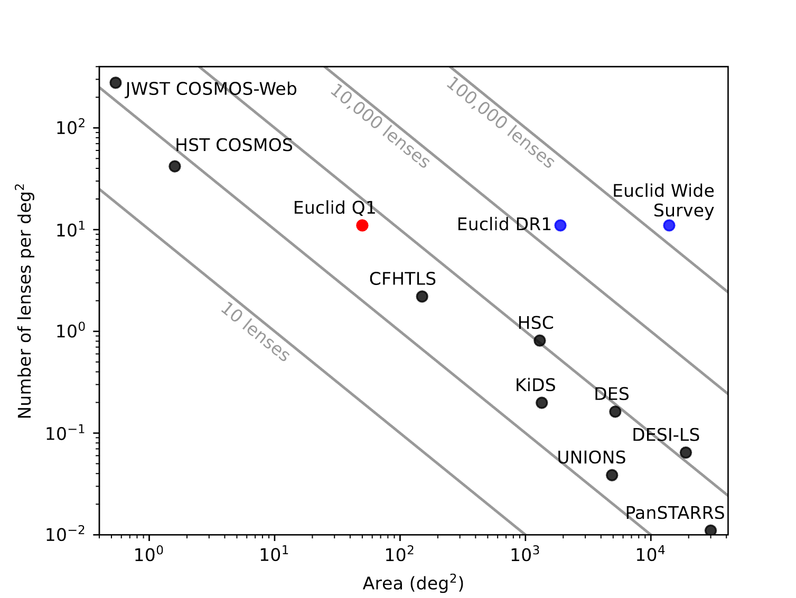

# Lenses by Survey

Add your surveys! Use a pull request.

Originally made by Mike Walmsley for the Euclid Q1 discoveries, with data and advice from the Euclid Strong Lensing Discovery Team (particularly Stefan Schuldt). JWST added by Natalie Lines. 